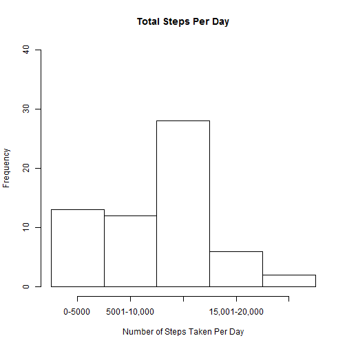
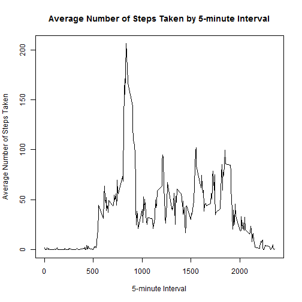
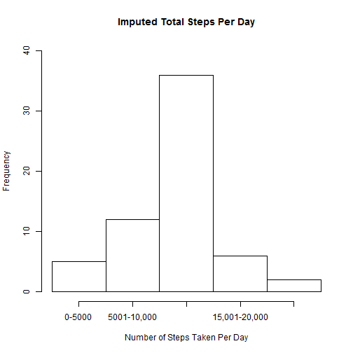
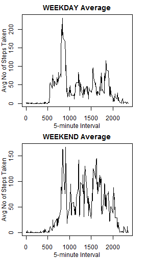

## Pre-Processing


```r
library(dplyr)
library(ggplot2)
library(xtable)

activity <- read.csv("activity.csv")
```

## What is mean total number of steps taken per day?

1. Calculate the total number of steps taken per day. 


```r
activitybyday <- group_by(activity,date)
totalstepsperday <- summarise(activitybyday, stepstotal = sum(steps, na.rm = TRUE), stepsmean = mean(steps, na.rm = TRUE), stepsmedian = median(steps, na.rm = TRUE))
```


2. Make a histogram of the total number of steps taken each day. 

 


Note that the `echo = FALSE` parameter was added to the code chunk to prevent printing of the R code that generated the plot.

3. Calculate and report the mean and median of the total number of steps taken per day.


```r
stepsmean <- mean(totalstepsperday$stepstotal, na.rm = TRUE)
stepsmedian <- median(totalstepsperday$stepstotal, na.rm = TRUE)
```

The mean of the total number of steps taken per day: 9354.2295082
The median of the total number of steps taken per day: 10395

## What is the average daily activity pattern?

1. Make a time series plot  (i.e. type = "l") of the 5-minute interval (x-axis) and the average number of steps taken, averaged across all days (y-axis)

Summarize data by interval:

```r
activitybyinterval <- group_by(activity,interval)
totalstepsperinterval <- summarise(activitybyinterval, stepstotal = sum(steps, na.rm = TRUE), stepsmean = mean(steps, na.rm = TRUE), stepsmedian = median(steps, na.rm = TRUE))
```

Time series plot:

```r
plot(totalstepsperinterval$interval, totalstepsperinterval$stepsmean , type = "l", 
     xlab = "5-minute Interval", 
     ylab = "Average Number of Steps Taken", 
     main = "Average Number of Steps Taken by 5-minute Interval") 
```

 

2. Which 5-minute interval, on average across all the days in the dataset, contains the maximum number of steps?

Find the interval with the maximum average number of steps across all days:

```r
intstepmax <- max(totalstepsperinterval$stepsmean,na.rm = TRUE)
intmax <- totalstepsperinterval[totalstepsperinterval$stepsmean %in% intstepmax,1]
```

The 5-minute interval with the maximum number of steps: 835

## Imputing Missing Values

Note that there are a number of days/intervals where there are missing values (coded as NA). The presence of missing days may introduce bias into some calculations or summaries of the data.

1. Calculate and report the total number of missing values in the dataset (i.e. the total number of rows with NAs)


```r
numOK <- complete.cases(activity)
numNA <- sum(!numOK)
```

Total number of rows with NA: 2304

2. Devise a strategy for filling in all of the missing values in the dataset. The strategy does not need to be sophisticated. For example, you could use the mean/median for that day, or the mean for that 5-minute interval, etc.

The missing values are filled with the mean for that 5-minute interval. We assume that the 5-minute intervals will have similar results replace the missing values with that mean.

3. Creating a new dataset that is equal to the original dataset but with the missing data filled in with the mean for that 5-minute interval


```r
impdata <- mutate(activitybyinterval, steps = ifelse(is.na(steps), mean(steps, na.rm = TRUE), steps))
```

4. Make a histogram of the total number of steps taken each day and Calculate and report the mean and median total number of steps taken per day. Do these values differ from the estimates from the first part of the assignment? What is the impact of imputing missing data on the estimates of the total daily number of steps?

Calculate the total number of steps taken each day


```r
imputedbyday <- group_by(impdata,date)
imputedstepsbyday <- summarise(imputedbyday, stepstotal = sum(steps, na.rm = TRUE))
```

 

Reporting the mean and median total number of steps taken per day

```r
impstepsmean <- mean(imputedstepsbyday$stepstotal, na.rm = TRUE)
impstepsmedian <- median(imputedstepsbyday$stepstotal, na.rm = TRUE)
```

The mean of the total number of steps taken per day: 1.0766189 &times; 10<sup>4</sup>
The median of the total number of steps taken per day: 1.0766189 &times; 10<sup>4</sup>

These results are different than those reported earlier. The original recorded mean and median were 9354.2295082 and 10395 respectively. The imputed data mean is higher than the original mean (10395) and the imputed median is higher than the original (1.0766189 &times; 10<sup>4</sup>).

## Are there differences in activity patterns between weekdays and weekends?

For this part the weekdays() function may be of some help here. Use the dataset with the filled-in missing values for this part.

1. Create a new factor variable in the dataset with two levels - "weekday" and "weekend" indicating whether a given date is a weekday or weekend day.

Convert date data to date format

```r
impdata$date <- as.Date(impdata$date, format = "%Y-%m-%d")
```

Create a new factor variable indicating the weekdays and weekend days

```r
impdataweek <- mutate(impdata,dayoftheweek = weekdays(date), weekend = ifelse(dayoftheweek %in% c("Saturday","Sunday"), yes = "Weekend", no = 
"Weekday") )
```

Check the factor was created correctly

```r
table(impdataweek$dayoftheweek)
```

```
## 
##    Friday    Monday  Saturday    Sunday  Thursday   Tuesday Wednesday 
##      2592      2592      2304      2304      2592      2592      2592
```

```r
table(impdataweek$weekend)
```

```
## 
## Weekday Weekend 
##   12960    4608
```

2. Make a panel plot containing a time series plot (i.e. type = "l") of the 5-minute interval (x-axis) and the average number of steps taken, averaged across all weekday days or weekend days (y-axis). See the README file in the GitHub repository to see an example of what this plot should look like using simulated data.

Prepare data for weekdays and weekends

```r
impdataweekday <- impdataweek[impdataweek$weekend %in% c("Weekday"),]

weekdaybyinterval <- group_by(impdataweekday,interval)
weekdayperinterval <- summarise(weekdaybyinterval, weekdaystepsmean = mean(steps, na.rm = TRUE))

impdataweekend <- impdataweek[impdataweek$weekend %in% c("Weekend"),]

weekendbyinterval <- group_by(impdataweekend,interval)
weekendperinterval <- summarise(weekendbyinterval, weekendstepsmean = mean(steps, na.rm = TRUE))

weekdata <- cbind(weekdayperinterval,weekendperinterval)
```


```r
par(mfrow = c(2,1))
par(mar = c(3,3,2,2))
par(mgp = c(2,1,0))

with(weekdata, {


plot(weekdata$interval, weekdata$weekdaystepsmean , type = "l", 
     xlab = "5-minute Interval", 
     ylab = "Avg No of Steps Taken", 
     main = "WEEKDAY Average")

plot(weekdata$interval, weekdata$weekendstepsmean , type = "l", 
     xlab = "5-minute Interval", 
     ylab = "Avg No of Steps Taken", 
     main = "WEEKEND Average")
     
     })
```

 

```r
     dev.off()
```

```
## null device 
##           1
```
